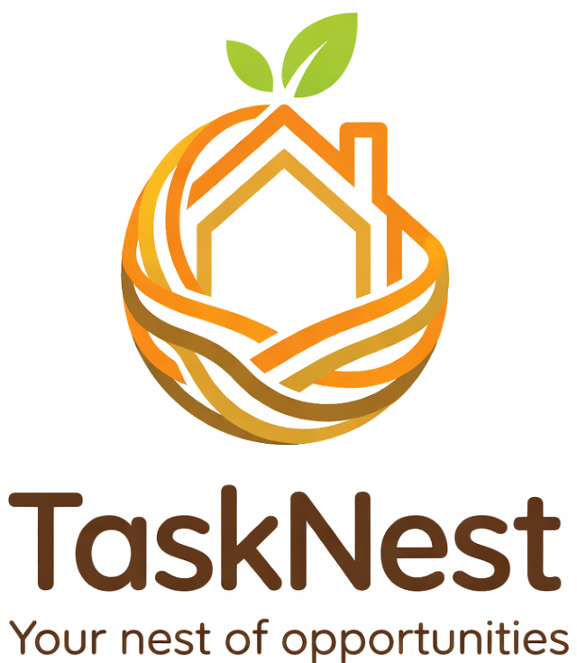
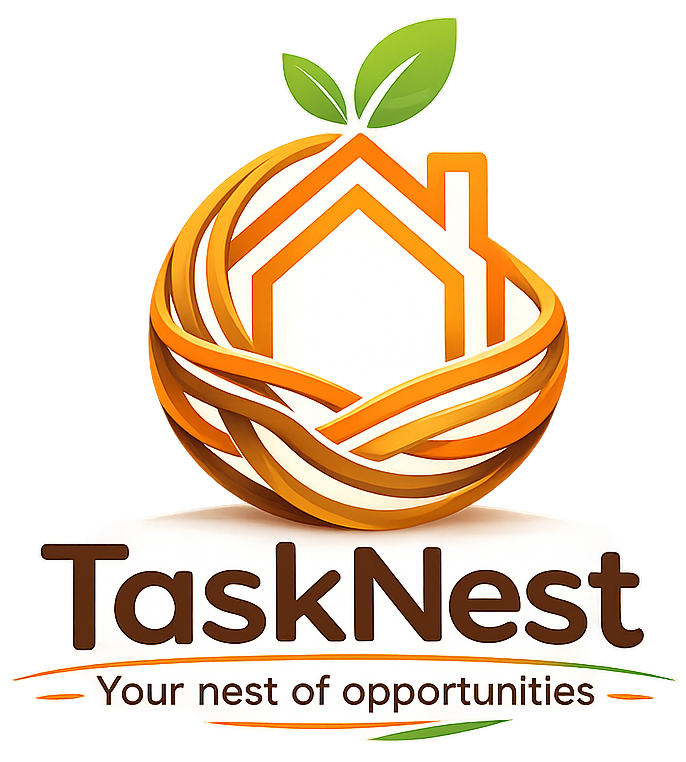

# 🚀 TaskNest — Your Nest of Opportunities

  

  <b>A Modern Real-Time Job & Task Collaboration Platform</b> 
  Connecting <b>Providers</b> and <b>Workers</b> seamlessly using React & Firebase.

---

---

## 🌐 Live Application

  
   
  Click the image to explore TaskNest live 🚀

---

## 📱 Instant Access (QR Code)

  

Scan the QR code to open <b>TaskNest</b> directly on your mobile device.

---

## ✨ Features

### 👤 Authentication
- Secure Firebase Authentication
- Role-based access system
- Persistent login sessions

### 💼 Job Marketplace
**Providers**
- Post new jobs
- Manage applicants
- Remove workers
- Mark jobs as completed
- Delete jobs

**Workers**
- Browse available jobs
- Apply instantly
- Cancel applications anytime

### ⚡ Real-Time Experience
- Firestore live updates
- Instant UI synchronization
- Smooth responsive dashboard

### 🔐 Security First
- Advanced Firestore Security Rules
- Ownership validation
- Protected database operations

---

## 🛠️ Tech Stack

| Layer | Technology |
|------|------------|
| Frontend | React + Vite |
| Styling | CSS / Modern UI Design |
| Backend | Firebase Firestore |
| Auth | Firebase Authentication |
| Hosting | Firebase Hosting |
| CI/CD | GitHub Actions |

---

## 🚀 Getting Started

To run this project locally:

## Clone the repo
   git clone [https://github.com/harishnukala90/TaskNest.git](https://github.com/harishnukala90/TaskNest.git)