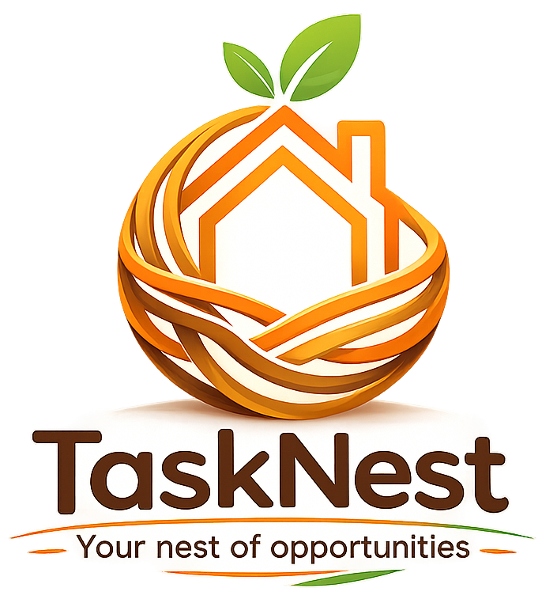

# 🚀 TaskNest

<p align="center">
  <a href="https://tasknest-73b8d.web.app/" target="_blank">
    
  </a>
</p>

<p align="center">
  <strong>Your Nest of Opportunities</strong><br>
  A real-time job platform connecting <strong>Providers</strong> and <strong>Workers</strong>.
</p>

---

[](https://github.com/harishnukala90/TaskNest/actions)


---

## ✨ What is TaskNest?

TaskNest is a simple job collaboration platform where:

- **Providers** post jobs  
- **Workers** apply for jobs  
- Everything updates in real time using Firebase  

---

## 📱 Open Anywhere

<p align="center">
  
</p>

Scan the QR code to open TaskNest directly on your phone.

---

## 🌐 Live Website

👉 **Open App:** <https://tasknest.site.je/>

---

## ⚡ Features

### 👤 Authentication

- Secure Firebase login
- Role-based users (Worker/Provider)
- Password strength validation
- Session persistence

### 💼 Providers Can

- Post jobs
- Manage applicants
- Remove workers
- Mark jobs completed
- Delete jobs

### 🧑‍🔧 Workers Can

- Browse jobs
- Apply instantly
- Cancel applications

### 🔒 Security

- Firestore security rules
- User ownership protection
- Input validation & sanitization
- Error boundaries for graceful error handling

### 📱 PWA Support

- Install as mobile/desktop app
- Offline capability
- Service worker caching
- Fast loading with caching strategies

### 🧪 Quality Assurance

- Unit testing with Vitest
- Component testing with React Testing Library
- Type-safe code structure

---

## 🛠 Tech Stack

- **Frontend:** React 19 + Vite 7
- **Backend:** Firebase Firestore
- **Authentication:** Firebase Auth
- **Hosting:** Firebase Hosting
- **CI/CD:** GitHub Actions
- **Forms:** React Hook Form
- **Notifications:** React Hot Toast
- **Testing:** Vitest + React Testing Library
- **PWA:** Vite PWA Plugin

---

## 🚀 Run Locally

### 1. Clone project

```bash
git clone https://github.com/harishnukala90/TaskNest.git
cd TaskNest
```

### 2. Install packages

```bash
npm install
```

### 3. Environment Setup

Create `.env` file in the root directory:

```env
VITE_FIREBASE_API_KEY=your_api_key
VITE_FIREBASE_AUTH_DOMAIN=your_auth_domain
VITE_FIREBASE_PROJECT_ID=your_project_id
VITE_FIREBASE_STORAGE_BUCKET=your_storage_bucket
VITE_FIREBASE_MESSAGING_SENDER_ID=your_sender_id
VITE_FIREBASE_APP_ID=your_app_id
```

> ⚠️ **Important:** Never commit your `.env` file to version control!

### 4. Start app

```bash
npm run dev
```

Open: <http://localhost:5173>

---

## 🧪 Testing

```bash
# Run tests once
npm run test:run

# Run tests with UI
npm run test:ui

# Run tests with coverage
npm run test:coverage

# Watch mode
npm run test
```

---

## 📦 Building for Production

```bash
npm run build
```

Preview the production build:

```bash
npm run preview
```

---

## 🔧 Linting

```bash
npm run lint
```

---

## 🛡️ Security Best Practices

1. **Environment Variables:** All sensitive Firebase config is stored in `.env` files
2. **Firestore Rules:** Security rules protect user data and job applications
3. **Input Validation:** All form inputs are validated and sanitized
4. **Error Boundaries:** Graceful error handling prevents app crashes
5. **Toast Notifications:** User feedback without blocking UI

---

## 👨‍💻 Author

**Harish Nukala**

GitHub: <https://github.com/harishnukala90>

---

## 📄 License

MIT License

---

## 🙏 Acknowledgments

- [Firebase](https://firebase.google.com/) - Backend as a Service
- [Vite](https://vitejs.dev/) - Next Generation Frontend Tooling
- [React](https://react.dev/) - The library for web and native user interfaces
- [React Hot Toast](https://react-hot-toast.com/) - Smoking hot toast notifications
- [Vitest](https://vitest.dev/) - Next generation testing framework

---

⭐ If you like this project, give it a star!
